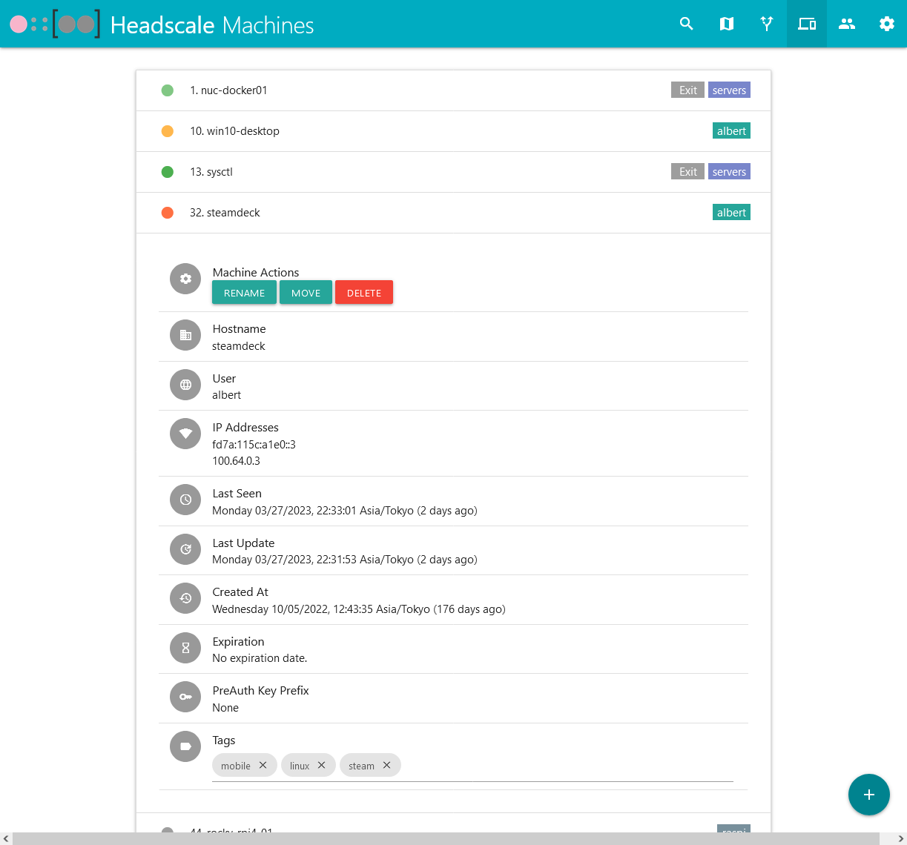
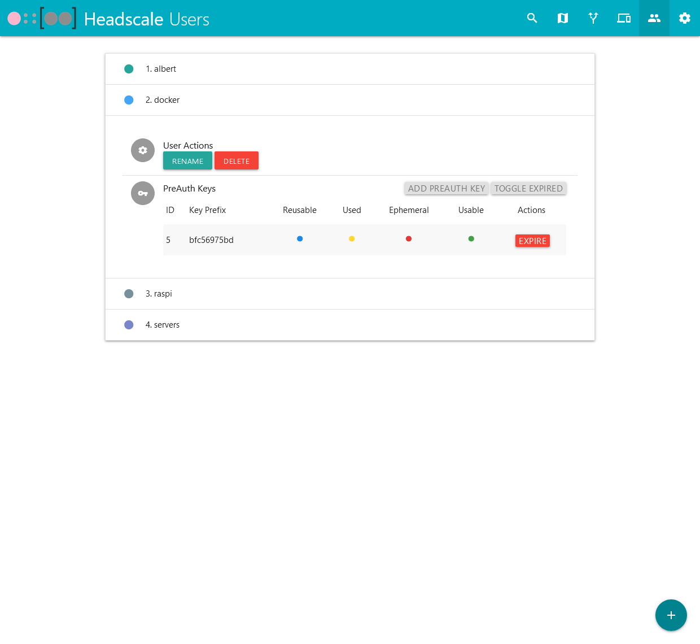
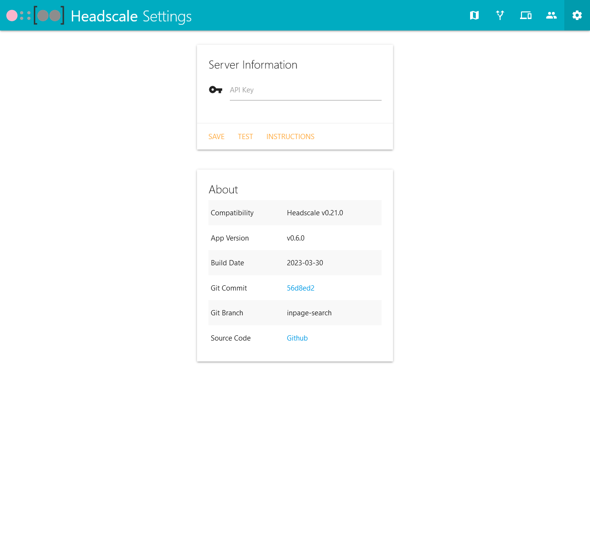

Fork from: https://github.com/iFargle/headscale-webui

 !!!!!!!!!!!!!!!!!!WARRNING!!!!!!!!!!!!!!!!!!
 1. 本项目仅适用于headscale023版本, 对023部分变更的API接口进行适配修改, 其中OIDC相关功能未修改;
 2. 项目中包含Dcokerfile文件, 但属于原项目的分支, 本项目不适用此项目, 若有余力, 请自行构建镜像进行验证;
 3. 本项目不接受代码任何形式的贡献, 如有需求请移步至原项目;
 !!!!!!!!!!!!!!!!!!WARRNING!!!!!!!!!!!!!!!!!!

 !!!!!!!!!!!!!!!!!!WARRNING!!!!!!!!!!!!!!!!!!
 1. This project only applies to the headscale023 version, the 023 part of the changes in the API interface to adapt to the modification, which OIDC-related functions have not been modified.;
 2. the project contains Dcokerfile file, but belongs to the original project branch, this project does not apply to this file, if you have the spare capacity, please build your own image for verification;
 3. this warehouse does not accept any form of contribution to the code, if you need to move to the original project;
 4. The Eng ver Readme translated by Deepl;
 !!!!!!!!!!!!!!!!!!WARRNING!!!!!!!!!!!!!!!!!!

  

<h2 align="center">Headscale-WebUI</h3>

  A simple Headscale web UI for small-scale deployments.

  <a href="#Screenshots">Screenshots</a> | <a href="SETUP.md">Installation</a> | <a href="https://github.com/iFargle/headscale-webui/issues">Issues</a>

---
# Features
1.  Enable/Disable routes and exit nodes
    * Manage failover routes as well
2.  Add, move, rename, and remove machines
3.  Add and remove users/namespaces
4.  Add and expire PreAuth keys
5.  Add and remove machine tags
6.  View machine details
    * Hostname
    * User associated with the machine
    * IP addresses in the Tailnet
    * Last seen by the control server
    * Last update with the control server
    * Creation date
    * Expiration date (will also display a badge when nearing expiration)
    * PreAuth key associated with the machine
    * Enable / disable routes and exit nodes
    * Add and delete machine tags
7.  Basic and OIDC Authentication
    * OIDC Authentication tested with Authelia and Keycloak
8.  Change your color theme! See MaterializeCSS Documentation for Colors for examples.
9.  Search your machines and users.
    * Machines have tags you can use to filter search:
        * `tag:tagname` Searches only for specific tags
        * `machine:machine-name` Searches only for specific machines
        * `user:user-name` Searches only for specific users

---
# Installation
* See [SETUP.md](SETUP.md) for installation and configuration instructions.

---
# Screenshots:

---
# Tech used:
* Python - [Link](https://www.python.org/)
* Poetry - [Link](https://python-poetry.org/)
* MaterializeCSS - [Link](https://github.com/Dogfalo/materialize)
* jQuery - [Link](https://jquery.com/)

For Python libraries, see [pyproject.toml](pyproject.toml)

If you use this project, please reach out!  It keeps me motivated!  Thank you!
